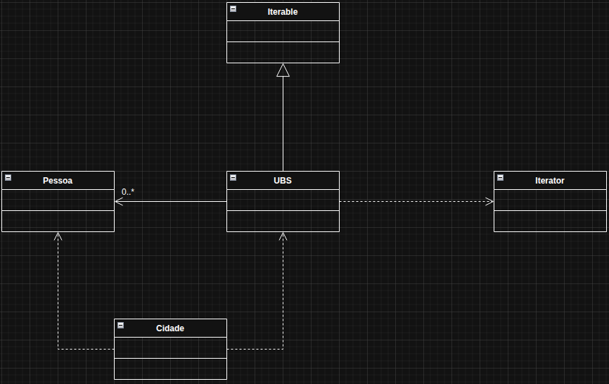

# Iterator

O Iterator é um padrão de projeto comportamental que permite percorrer os elementos de uma coleção (lista, árvore, etc.) sem expor sua estrutura interna. Resumindo: você usa um objeto iterador para acessar os itens um por um, sempre da mesma forma, independente de como a coleção é organizada.

No exemplo usado, foi pensado em uma cidade e como ela consegue contar a quantidade de pessoas que estão com seus cadastros em UBS atualizados, isso sem precisar conhecer a estrutura interna da classe UBS.

